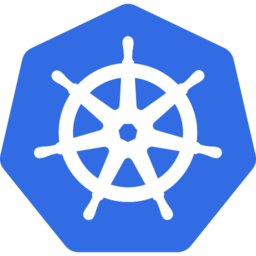
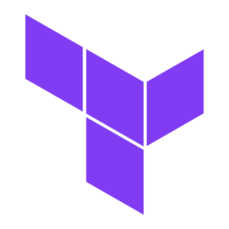

<h1 align="center">k8s-discord</h1>
<h1 align="center">
    
    
    
</h1>

<p align="center">
  Create a K8s cluster running a Discord bot using pure Terraform
</p>

<hr>

## What you will create ⭐

A distributed Discord bot using Slash commands in Kubernetes!

- A Kubernetes Cluster running on Azure Kubernetes Service ([AKS](https://azure.microsoft.com/en-us/services/kubernetes-service/#overview))
- A "frontend" app that listens and forwards incoming Discord Slash commands (uses [Discord.js](https://github.com/discordjs/discord.js))
- A "backend" app that reponds to HTTP requets from the frontend app and runs all your bots custom logic! (Using Python and Flask)

> Note: This is a "sister" repo to my other project [`kong-k8s-terraform`](https://github.com/GrantBirki/k8s-kong-terraform) feel free to checkout both and learn more about K8s and Terraform!

## Prerequisites 🚩

You will need a few things to use this project:

1. An [Azure](https://azure.microsoft.com/en-us/free/) account (this project uses AKS)
1. [tfenv](https://github.com/tfutils/tfenv) (for managing Terraform versions)
1. [kubectl](https://kubernetes.io/docs/tasks/tools/) (for applying K8s manifests)
1. [Azure CLI](https://docs.microsoft.com/en-us/cli/azure/install-azure-cli)
1. A [Terraform Cloud](https://www.terraform.io/cloud) account to store your TF state remotely
    - See the [`terraform-cloud`](docs/terraform-cloud.md) docs in this repo for more info (required if you are using Terraform Cloud)
1. Azure credentials to run Terraform deployments. An example to create creds can be seen below (easy):
    - `az ad sp create-for-rbac --skip-assignment`
    - Copy the resulting `appId` and `password` to -> `terraform/k8s-cluster/terraform.auto.tfvars.json`
1. You will need to skim through the following files and edit the lines with comments:
    - [`terraform\k8s-cluster\versions.tf`](terraform\k8s-cluster\versions.tf)
    - [`terraform\k8s-cluster\variables.tf`](terraform\k8s-cluster\variables.tf)
    - [`terraform\k8s\k8s-cluster.tf`](terraform\k8s\k8s-cluster.tf)

    > Example: Updating values with your own unique K8s cluster name and pointing to your own Terraform cloud workspaces
1. A Discord bot with Slash command permissions set and a token - [Discord Documentation](https://discord.com/developers/docs/interactions/application-commands)

## Usage 💻

Build a K8s cluster with a single command!

> Go make a coffee while this runs because it can take up to 15 minutes

```console
$ make build

🔨 Let's build a K8s cluster!
✅ tfenv is installed
✅ Azure CLI is installed
✅ kubectl is installed
✅ terraform/k8s-cluster/terraform.auto.tfvars.json exists
✅ terraform/k8s-cluster/terraform.auto.tfvars.json contains non-default credentials
🚀 Deploying 'terraform/k8s-cluster'...
⛵ Configuring kubectl environment
🔨 Time to build K8s resources and apply their manifests on the cluster!
✅ All manifests applied successfully
✨ Done! ✨
```

If all went as planned you should now have a very simple Discord bot that can respond to Slash commands!

You can use either of the commands to test:

- `/ping` - Returns `pong`
- `/health` - Returns the health of the "backend" app

When you are done using your K8s cluster, you may destroy it by executing the following command:

```console
$ make destroy

💥 Let's DESTROY your K8s cluster!
Continue with the complete destruction of your K8s cluster (y/n)? y
✅ Approval for destroy accepted
✅ tfenv is installed
✅ terraform/k8s-cluster/terraform.auto.tfvars.json exists
✅ terraform/k8s-cluster/terraform.auto.tfvars.json contains non-default credentials
💥 Destroying 'terraform/k8s'...
💥 Destroying 'terraform/k8s-cluster'...
✨ Done! ✨
```

## Project Folder Information 📂

- `script/` - Contains various scripts for deployments and maintenance
- `src/` - Contains the source code for the bot (frontend and backend)
- `terraform/k8s-cluster` - The main terraform files for building the infrastructure of the K8s cluster. This folder contains configurations for the amount of K8s nodes, their VM size, their storage, etc
- `terraform/k8s/*` - Kubernetes deployment manifests and Terraform files for Kong, Grafana/Prometheus, and the NGINX example http server

## GitHub Actions ⚡

Once you have successfully built your K8s cluster and tested its functionality, you can deploy it using CI/CD with GitHub actions!

To do so, check out the following documentation in this repo: [`github-actions`](docs/github-actions.md)

## Purpose 💡

The purpose of this project/repo is to quickly build a minimal K8s cluster with Terraform to get a Discord bot with Slash commands going.

## Contributing 👩‍💻

All contributions are welcome! If you have any questions or suggestions, please open an issue or fork this repo and create a pull request!
