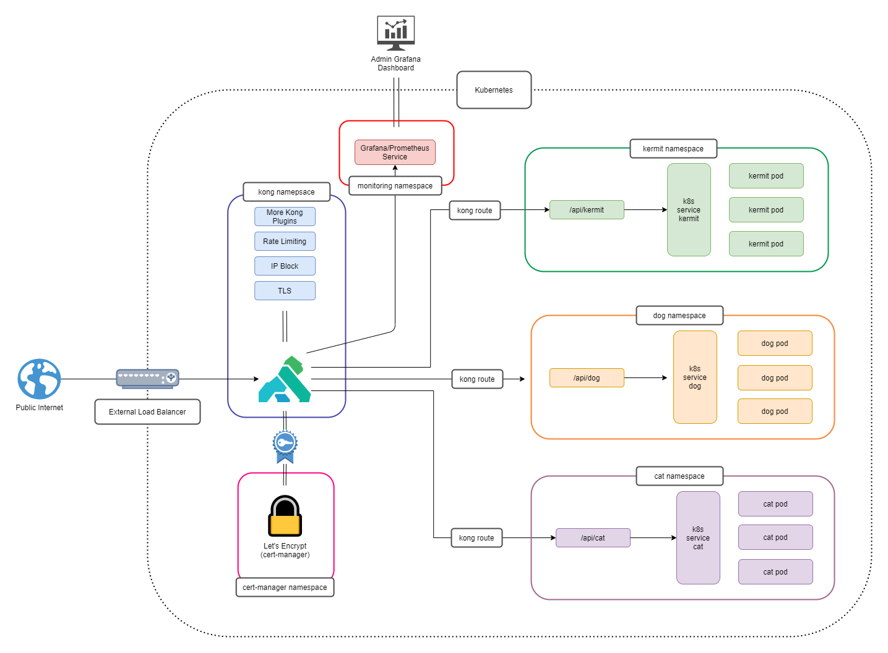

NOTE: ALL THIS DOCS ARE STALE FROM PREVIOUS PROJECT


<h1 align="center">k8s-discord</h1>
<h1 align="center">
    
    
    
</h1>

<p align="center">
  Create a K8s cluster with a Kong Ingress using pure Terraform
  <br>
  Once deployed, a sample NGINX HTTP application will be up and running for you to test against
</p>

<hr>

## What you will create

- A Kubernetes Cluster running on Azure Kubernetes Service ([AKS](https://azure.microsoft.com/en-us/services/kubernetes-service/#overview))
- A K8s ingress controller using [Kong](https://konghq.com/)
- Grafana/Prometheus [dashboards](https://grafana.com/grafana/dashboards/7424) for viewing network metrics from Kong (made for you)
- A sample [NGINX](https://www.nginx.com/) application which serves HTTP requests (loadbalanced by Kong)
- (optionally) Enable TLS encryption on your external facing Kong ingress for security (using [cert-manager](https://cert-manager.io/docs/)!

## Prerequisites

You will need a few things to use this project:

1. An [Azure](https://azure.microsoft.com/en-us/free/) account (this project uses AKS)
1. [tfenv](https://github.com/tfutils/tfenv) (for managing Terraform versions)
1. [kubectl](https://kubernetes.io/docs/tasks/tools/) (for applying K8s manifests)
1. [Azure CLI](https://docs.microsoft.com/en-us/cli/azure/install-azure-cli)
1. A [Terraform Cloud](https://www.terraform.io/cloud) account to store your TF state remotely
    - See the [`terraform-cloud`](docs/terraform-cloud.md) docs in this repo for more info (required if you are using Terraform Cloud)
1. Azure credentials to run Terraform deployments. An example to create creds can be seen below (easy):
    - `az ad sp create-for-rbac --skip-assignment`
    - Copy the resulting `appId` and `password` to -> `terraform/k8s-cluster/terraform.auto.tfvars.json`
1. You will need to skim through the following files and edit the lines with comments:
    - [`terraform\k8s-cluster\versions.tf`](terraform\k8s-cluster\versions.tf)
    - [`terraform\k8s-cluster\variables.tf`](terraform\k8s-cluster\variables.tf)
    - [`terraform\k8s\k8s-cluster.tf`](terraform\k8s\k8s-cluster.tf)

    > Example: Updating values with your own unique K8s cluster name and pointing to your own Terraform cloud workspaces

## Usage

Build a K8s cluster with a single command!

> Go make a coffee while this runs because it can take up to 15 minutes

```console
$ make build

🔨 Let's build a K8s cluster!
✅ tfenv is installed
✅ Azure CLI is installed
✅ kubectl is installed
✅ terraform/k8s-cluster/terraform.auto.tfvars.json exists
✅ terraform/k8s-cluster/terraform.auto.tfvars.json contains non-default credentials
🚀 Deploying 'terraform/k8s-cluster'...
⛵ Configuring kubectl environment
🔨 Time to build K8s resources and apply their manifests on the cluster!
✅ All manifests applied successfully
🦍 Kong LoadBalancer IP: 123.123.123.123
📊 Run 'script/grafana' to connect to the Kong metrics dashboard
✨ Done! ✨
```

The K8s cluster uses Kong as a Kubernetes Ingress Controller and comes with a sample NGINX backend to serve HTTP requests

To get the external IP of your `kong-proxy`, log into your Azure account and check your `Services and Ingresses` section of your newly deployed K8s cluster. You will see a link to the extranal IP of your new LoadBalancer to make an HTTP request for testing.

When you are done using your K8s cluster, you may destroy it by executing the following command:

```console
$ make destroy

💥 Let's DESTROY your K8s cluster!
Continue with the complete destruction of your K8s cluster (y/n)? y
✅ Approval for destroy accepted
✅ tfenv is installed
✅ terraform/k8s-cluster/terraform.auto.tfvars.json exists
✅ terraform/k8s-cluster/terraform.auto.tfvars.json contains non-default credentials
💥 Destroying 'terraform/k8s-cluster'...
✨ Done! ✨
```

### Enabling TLS 🔒

This is a bonus / expirmental section. It "works on my machine ™" but it will take a smidge of manual setup, knowledge of letsencrypt, DNS, etc

What you need first (pre-reqs):

- A domain name (www.example.com)
- A way to confirgure DNS records for your domain (route53, AzureDNS, etc)
- A working DNS cluster that has been built with `make build` (above) - Copy down your Kong Proxy IP

#### Steps

These are a mix of steps and an outline of the `make enable-tls` helper script

1. Execute the following command: `make enable-tls`
    - This will invoke a bash script which will swap around some files, prompt you for some input, and inject said input into K8s manifests via sed
1. It is recommended to say yes (y) to everything and enter the information requested
1. When prompted, create DNS records that point to your K8s cluster. You will need an A record that points to your Kong LoadBalancer ingress and a CNAME that maps to the A record at a minimum
1. When prompted, edit each listed K8s manifest file to your liking. This part requires you to have a bit of K8s knowledge in what you need to use and where. Each manifest file is commented to help you along!
1. The end of the script will run a full deployment of the cluster
1. It will take a few minutes for everything to settle and for your TLS certificates to be provisioned. Happy encryption! 🔒

## Project Folder Information 📂

- `script/` - Contains various scripts for deployments and maintenance
- `terraform/k8s-cluster` - The main terraform files for building the infrastructure of the K8s cluster. This folder contains configurations for the amount of K8s nodes, their VM size, their storage, etc
- `terraform/k8s/*` - Kubernetes deployment manifests and Terraform files for Kong, Grafana/Prometheus, and the NGINX example http server

## Purpose 💡

The purpose of this project/repo is to quickly build a minimal K8s cluster with Kong + Terraform to get a project going.

## Example Diagram 🗺

The diagram below shows an example of what a K8s cluster would look like with this deployment.

> Note: Rather than having a `kermit`, `cat`, and `dog` service - you would just have one service, the `nginx-example`


